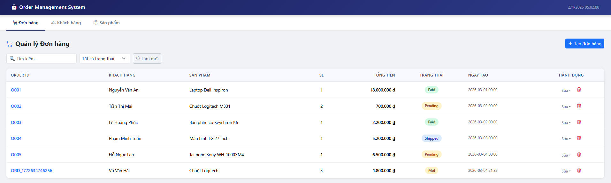
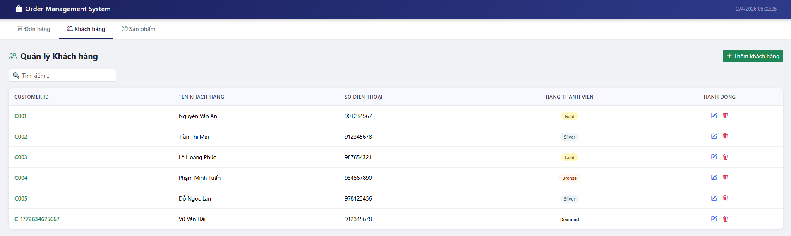
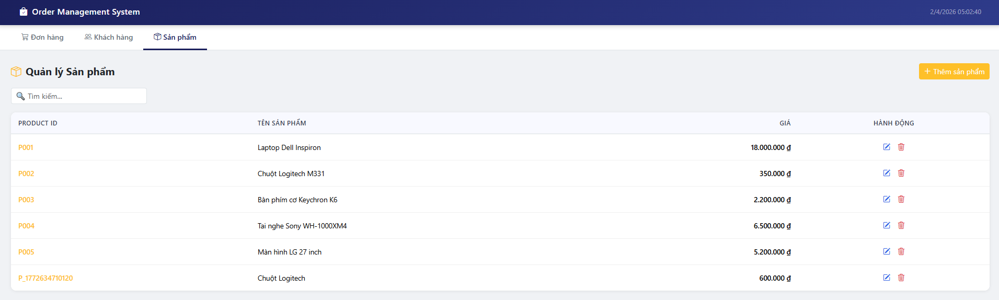
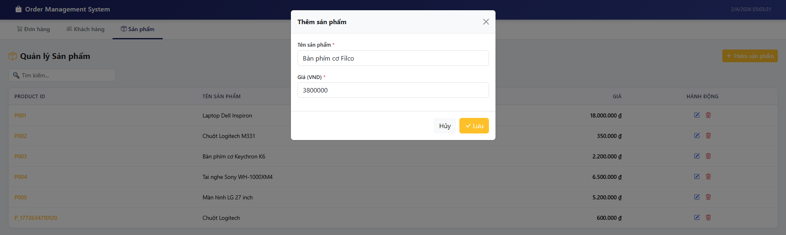

# Order Management System

## Prompt

```text
Hãy đóng vai chuyên gia Full-Stack Google Apps Script.
Tôi có một Google Sheets đóng vai trò database với các sheet sau:
- Sheet: Departments gồm các cột: Dept_ID, Dept_Name, Emails. Sheet này lưu thông tin phòng ban và danh sách email nhận thông báo đơn hàng.
- Sheet: Customers gồm các cột: Customer_ID, Customer_Name, Phone, Member_Level. Sheet này lưu thông tin khách hàng.
- Sheet: Products gồm các cột: Product_ID, Product_Name, Price. Sheet này lưu thông tin sản phẩm.
- Sheet: Orders gồm các cột: Order_ID, Customer_ID, Product_ID, Quantity, Total_Amount, Status, Created_At. Sheet này lưu dữ liệu đơn hàng.

1. Nhiệm vụ của bạn
- Hãy xây dựng một Web App quản lý đơn hàng hoàn chỉnh bằng Google Apps Script, kết nối trực tiếp với Google Sheets database trên.

2. Hệ thống phải hỗ trợ các chức năng sau:
- Quản lý Khách hàng: Thêm, sửa, xóa, Xem danh sách khách hàng
- Quản lý Sản phẩm: Thêm, sửa, xóa, Xem danh sách sản phẩm
- Quản lý Đơn hàng: Tạo đơn hàng mới, Chọn khách hàng, Chọn sản phẩm, Nhập số lượng. Hệ thống tự động tính Total_Amount
- Gửi Email Thông Báo: Khi có đơn hàng mới được tạo, hệ thống phải Lấy danh sách email từ sheet Departments và Gửi email thông báo 
- Nội dung email gồm: Order ID, Tên khách hàng, Tên sản phẩm, Số lượng, Tổng tiền, Ngày tạo đơn

- Tách code thành các file: Code.gs, Index.html, JavaScript.html, CSS.html
- Sử dụng server-side include() để nhúng file HTML.

- Yêu cầu quan trọng: 
- Code phải chạy được ngay sau khi deploy
- Không có lỗi silent error
- Các chức năng CRUD hoạt động đầy đủ
- Email gửi thành công khi có đơn hàng mới.
```

## Result








